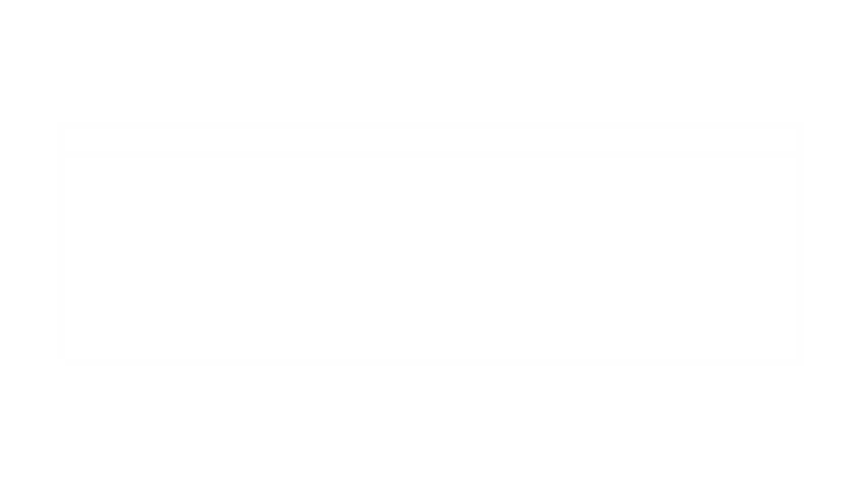

# VCR (Video Component Renderer)

A headless motion graphics renderer that compiles declarative YAML scenes into broadcast-quality ProRes 4444 video with alpha transparency.
Built in Rust, GPU-accelerated on Apple Silicon, and designed to render in seconds.


**Perfect for:** motion graphics overlays, animated lower thirds, branded graphics, procedural backgrounds, and repeatable graphics pipelines you would normally build in After Effects but want to control in code.

## Why VCR?

After Effects is powerful, but it is hard to automate, hard to version cleanly, and too slow for tight iteration loops. Remotion is great for web-style video generation, but post workflows often need NLE-ready ProRes 4444 with real alpha.

VCR is built for that gap: declarative manifests you can version, deterministic output (same input, same frames), and GPU-accelerated rendering that is fast enough for creative iteration. Write a manifest, render in seconds, and drop the `.mov` straight into Premiere, Resolve, or any NLE that supports alpha.

VCR is not a replacement for a full motion design GUI. It is best when you want reproducibility, speed, and automation.

## Feature Highlights

- YAML scene manifests (`.vcr`) that are human-readable and version-controllable.
- Metal-backed GPU rendering on Apple Silicon, with CPU fallback.
- Deterministic rendering: same input produces the same output.
- Expression-driven animation: `sin`, `cos`, `clamp`, `lerp`, `smoothstep`, `easeInOut`, `noise1d`, `env`.
- Layered compositing with z-order, transforms, and alpha blending.
- Procedural layers (`solid_color`, `gradient`) plus image assets.
- ProRes 4444 output with transparent alpha channel.
- CLI-first workflow: no GUI dependency, no Electron overhead.

## Quick Example (Welcome to First Principles)

`examples/welcome_terminal_scene.vcr` renders the lower third shown below.



```yaml
# Terminal box lower third that flashes in, reveals text, then fades out
version: 1
environment:
  resolution:
    width: 2560
    height: 1440
  fps: 24
  duration:
    frames: 120

params:
  box_flash_speed: 1.0
  text_fade_delay: 20
  text_fade_speed: 1.0
  fade_out_start: 100

layers:
  - id: terminal_box
    z_index: 1
    pos_x: 180
    pos_y: 360
    opacity: "lerp((sin(t * box_flash_speed / 2) * 0.5 + 0.5), 1.0, smoothstep(10, 11, t)) * (1.0 - smoothstep(fade_out_start, fade_out_start + 20, t))"
    image:
      path: "../assets/terminal_box.png"

  - id: welcome_text
    z_index: 2
    pos_x: 320
    pos_y: 648
    scale: [0.8, 0.8]
    opacity: "smoothstep(text_fade_delay, text_fade_delay + 20 / text_fade_speed, t) * (1.0 - smoothstep(fade_out_start, fade_out_start + 20, t))"
    image:
      path: "../assets/welcome_text_geist_pixel.png"
```

**Output:** clean ProRes 4444 with alpha, ready to drop into an edit timeline.

## Getting Started (Golden Path)

```bash
# Install Rust (if needed)
curl --proto '=https' --tlsv1.2 -sSf https://sh.rustup.rs | sh

# Clone the repo
git clone https://github.com/coltonbatts/VCR.git
cd VCR

# Build (optimized)
cargo build --release

# Validate a manifest
cargo run --release -- check examples/welcome_terminal_scene.vcr

# Preview frames (fast, FFmpeg-free)
cargo run --release -- preview examples/welcome_terminal_scene.vcr --image-sequence -o ./preview_frames

# Render to ProRes 4444 + alpha
cargo run --release -- build examples/welcome_terminal_scene.vcr -o output.mov

# Drop output.mov into Premiere/Resolve/any NLE with alpha support
```

## Requirements

- Rust (stable)
- FFmpeg (required for `.mov`/ProRes encoding)
- macOS recommended for Apple Silicon Metal acceleration
- Linux/Windows may work, but are not officially tested in this repo

## CLI Commands (Quick Reference)

- `check <manifest>`: validate and summarize a manifest
- `lint <manifest>`: report common scene issues
- `dump <manifest> --frame N`: print resolved state at frame `N`
- `preview <manifest>`: render preview frames quickly (`--image-sequence` avoids FFmpeg)
- `render-frame <manifest> --frame N -o frame.png`: render one frame
- `render-frames <manifest> --start-frame N --frames X -o frames_dir`: render a frame range
- `build <manifest> -o output.mov`: full ProRes 4444 render
- `watch <manifest>`: hot-reload preview on manifest changes

Run `cargo run --release -- --help` for full CLI options.

## Figma -> VCR Workflow CLI (MVP)

This repo now includes an MVP workflow binary for product cards:

```bash
cargo run --release --bin figma-vcr-workflow -- \
  --figma-file "https://www.figma.com/file/<FILE_KEY>/Product-Cards" \
  --description "product card: pink skirt, $29.99" \
  --output-folder "./exports"
```

Optional:

- `--frame-project "prj_xxxxx"` to request Frame.io upload (currently a non-blocking MVP placeholder)
- `--skip-render` to only extract data + generate manifest
- `--render-timeout-seconds 30` to cap render duration
- `--verbose` to print layer selection, extracted text, and layout debugging details

Recent quality polish notes:

- `docs/figma-vcr-output-quality-polish-2026-02-10.md`

Required environment variables:

- `FIGMA_TOKEN`: Figma personal access token

Optional environment variables:

- `ANTHROPIC_API_KEY`: if set, Claude is used to generate the manifest
- `ANTHROPIC_MODEL`: override default Claude model
- `FRAME_IO_TOKEN`: token used for future Frame.io upload wiring

Expected Figma card structure (MVP assumption):

- Frame containing layers named `product_image`, `product_name`, and `price`
- Optional layers: `description`, `background`

The command writes a run folder under `--output-folder` with:

- extracted Figma JSON (`product_card_data.json`)
- downloaded layer PNGs
- generated manifest (`product_card.vcr`)
- rendered output (`product_card.mov`, unless `--skip-render`)

## Manifest Format (High-Level)

A `.vcr` file is structured around:

- `environment`: resolution, fps, duration
- `params`: global scalar controls
- `modulators`: reusable animation drivers
- `layers`: actual render content

See [examples/](examples/) for complete, working manifests.

## Performance Notes

Measured on M1 Max using the repo demo scene (`2560x1440`, 5 seconds):

- GPU (Metal): total pipeline about `1.39s`, wall time about `2.51s`
- CPU fallback: total pipeline about `12.57s`, wall time about `13.06s`
- Deterministic output: same input, same render
- Memory profile stays comfortably below 64GB on this workload

## Roadmap

- Native text rendering (today: pre-render text assets to PNG)
- Video layer support for compositing footage
- Blend modes and additional effects
- More production examples and docs

## License

MIT

## About

Built by Colton Batts ([@coltonbatts](https://github.com/coltonbatts)), a creative technologist in Fort Worth, TX.
VCR is part of a larger effort to help creatives adopt technical tools without losing their artistic voice.

More:

- [coltonbatts.com](https://coltonbatts.com)
- [First Principles](https://youtube.com/@firstprinciples)
